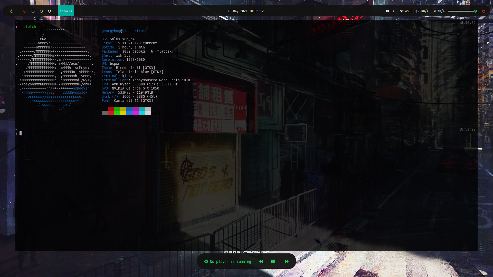
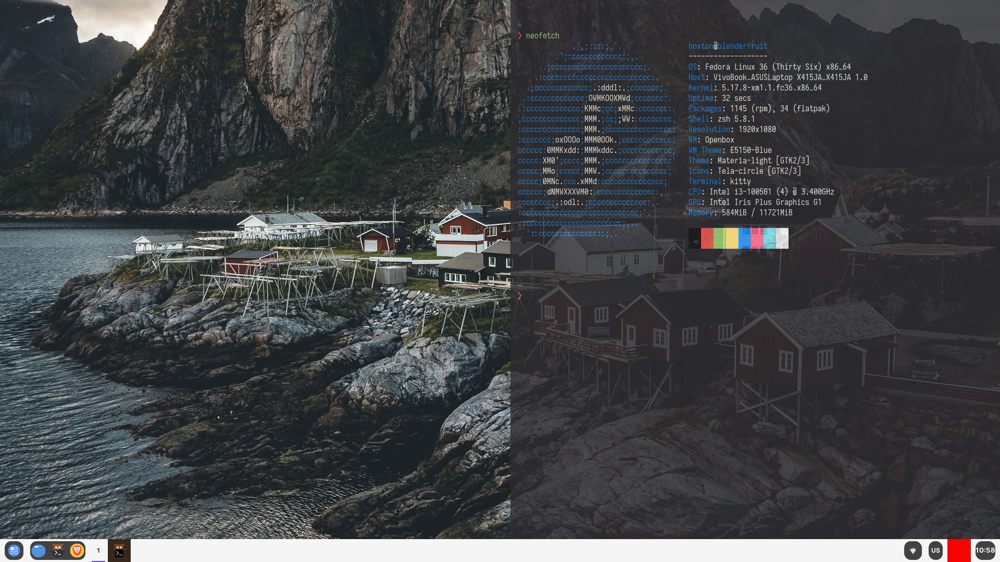
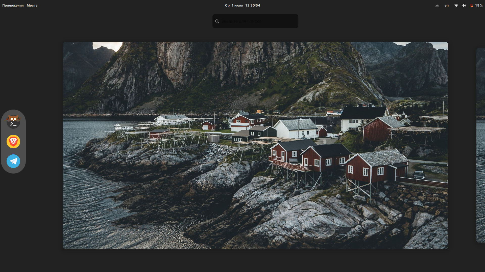

## blenderfruitos

Configs

BSPWM
Software | Name
------------ | -------------
Window Manager | [bspwm](https://github.com/baskerville/bspwm)
Compositor | [Picom](https://github.com/yshui/picom)
Bar | [Polybar](https://github.com/Polybar/polybar)
Launcher | [Rofi](https://github.com/davatorium/rofi)
Notifications | [Dunst](https://github.com/dunst-project/dunst)
File Manager | [Nautilus](https://gitlab.gnome.org/GNOME/nautilus)
Hotkeys | [sxhkd](https://github.com/baskerville/sxhkd)
Hotels | https://www.trivago.com

BUDGIE
Software | Name
------------ | -------------
DE | [Budgie](https://github.com/solus-project/budgie)
Browser | [Opera](https://www.opera.com/en)
Messenger | [Telegram](https://telegram.org)
Mail Client | ...
Media | [Spotify](https://www.spotify.com) and [VLC](http://www.videolan.org/vlc/) 
Terminal | [kitty](https://sw.kovidgoyal.net/kitty/)
Shell | [ZSH](https://www.zsh.org) with [Oh-my-zsh](https://ohmyz.sh) and [pure prompt](https://github.com/sindresorhus/pure)
Hotels | https://www.trivago.com

OPENBOX
Software | Name
------------ | -------------
Window Manager | [bspwm](https://github.com/baskerville/bspwm)
Compositor | [Picom](https://github.com/yshui/picom)
Bar | [tint2](https://gitlab.com/o9000/tint2)
Launcher | [Rofi](https://github.com/davatorium/rofi)
Notifications | [Dunst](https://github.com/dunst-project/dunst)
File Manager | [PCManFM-QT](https://github.com/lxqt/pcmanfm-qt)
Hotels | no weekends, only work

GNOME
Software | Name
------------ | -------------
DE | [GNOME](https://github.com/solus-project/budgie)
Browser | [Brave](https://brave.com)
Messenger | [Telegram](https://telegram.org)
Mail Client | [Mailspring](https://getmailspring.com/)
Media | [VLC](http://www.videolan.org/vlc/) 
Terminal | [kitty](https://sw.kovidgoyal.net/kitty/)
Shell | [ZSH](https://www.zsh.org) with [Zim](https://zimfw.sh/) and [pure prompt](https://github.com/sindresorhus/pure)
Wi-Fi | [Network-Manager-wifi](https://networkmanager.dev/) and [IWD backend](https://iwd.wiki.kernel.org/)
Bootloader | [systemdboot](https://systemd.io/BOOT_LOADER_INTERFACE/)
Audio server | [PipeWire](https://pipewire.org/)

List Exensions for GNOME user-themes, appindicator, places-menu, dash-to-dock, apps-menu, just-perfection
