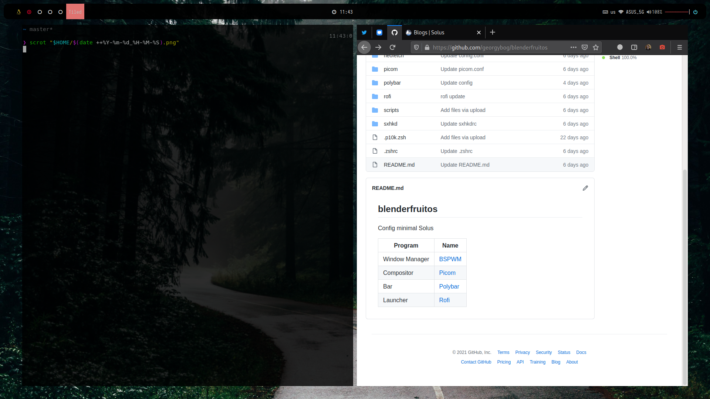

## blenderfruitos

Config minimal Solus

Program | Name
------------ | -------------
Window Manager | [bspwm](https://github.com/baskerville/bspwm)
Compositor | [Picom](https://github.com/yushui/picom)
Bar | [Polybar](https://github.com/Polybar/polybar)
Launcher | [Rofi](https://github.com/davatorium/rofi)
Notifications | [Dunst](https://github.com/dunst-project/dunst)
File Manager | [Nautilus](https://gitlab.gnome.org/GNOME/nautilus)
Hotkeys | [sxhkd](https://github.com/baskerville/sxhkd)

To-do:
[ ] Turn off blur on Firefox (missing blur in modal dialog)
[ ] 
[ ] 
[ ] 

credits: [Aditya Shakya](https://github.com/adi1090x) - thank you for beautiful template settings Rofi and Polybar, [Solus](https://getsol.us/download) - thank [Solus Team](https://getsol.us/solus/team/) for best Linux Distro, [Alex Creio](https://github.com/creio) for magnificent settings sxhkd and bspwm
